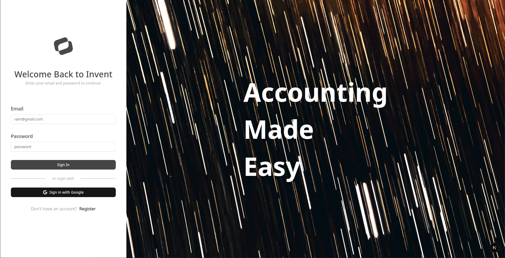
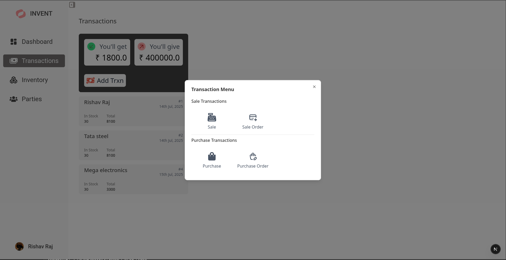
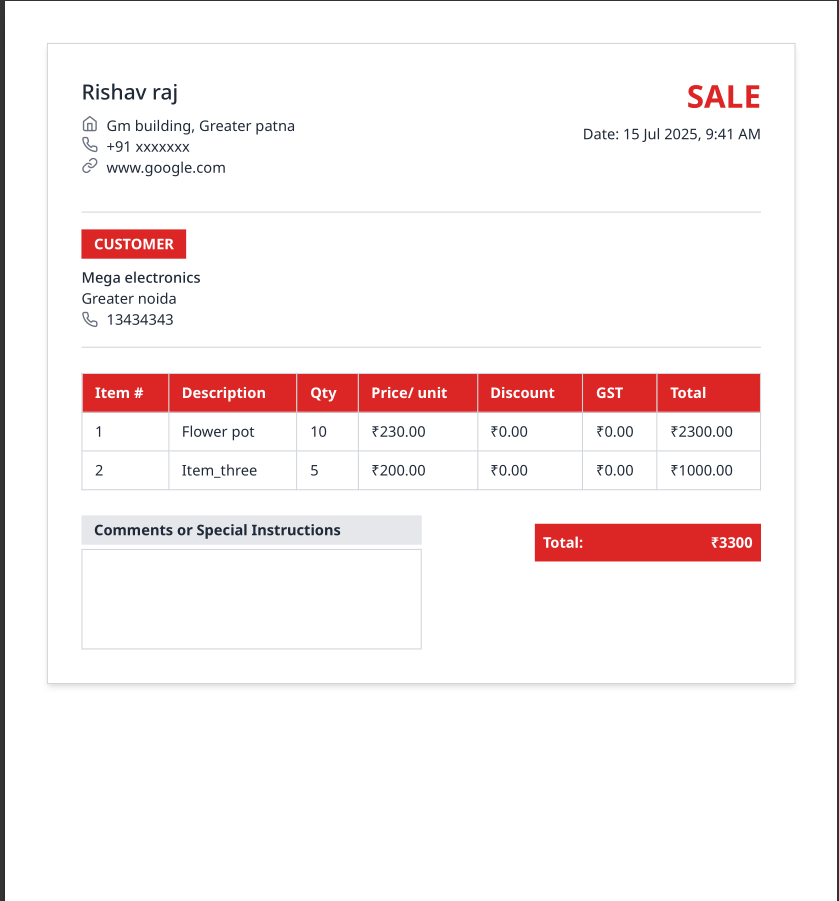
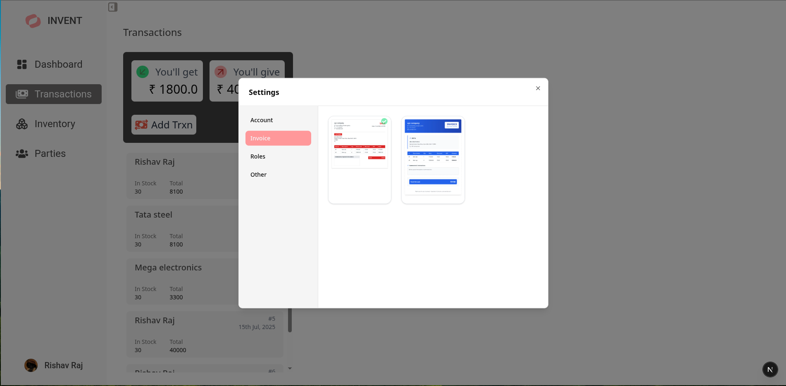
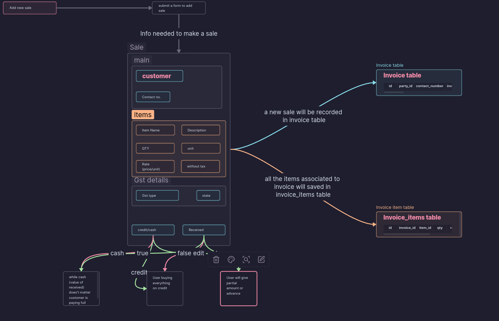
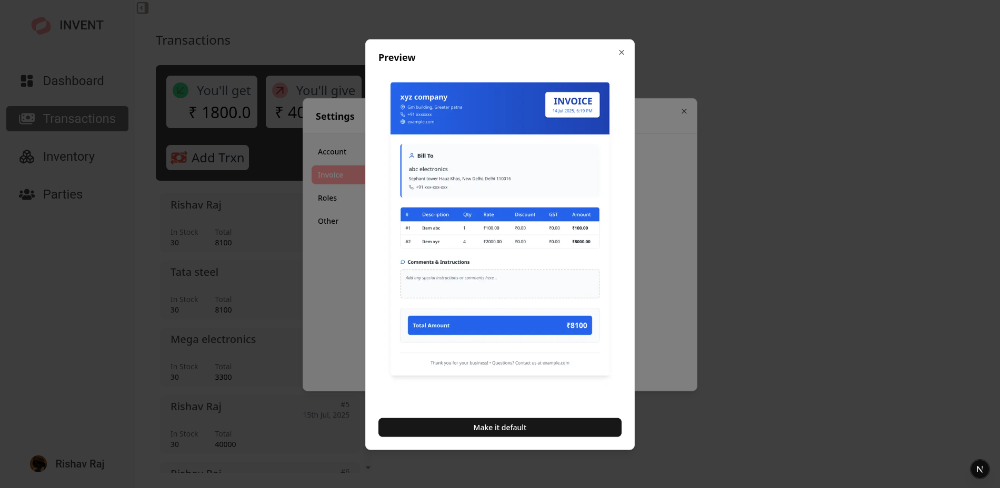
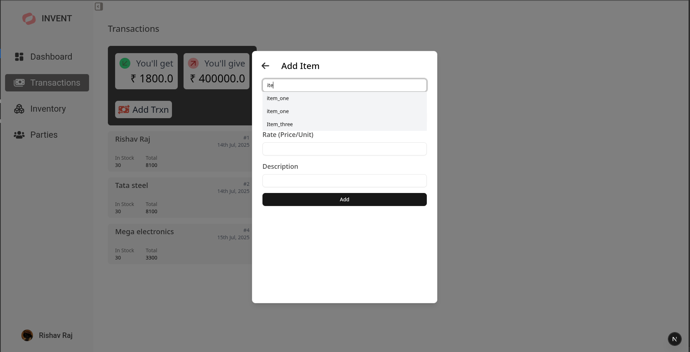
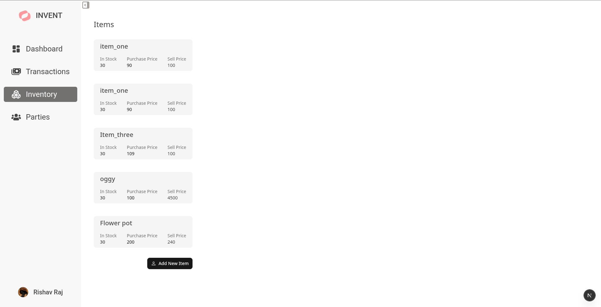
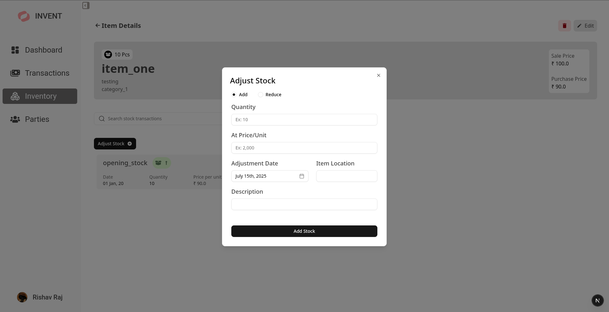

# 🧾 Invent — Inventory & Transaction Management System

**Invent** is a full-stack web application designed to help small to medium-sized businesses manage their **parties**, **inventory**, and **sales transactions** efficiently. It also allows users to **generate invoices in PDF format**, with plans for full GST compliance and advanced accounting features in the future.

---

## 🚀 Features

- ✅ Manage customers (parties) and inventory
- ✅ Record and track sales transactions
- ✅ Generate clean PDF invoices using Puppeteer
- ✅ Secure authentication with JWT (Passport.js)
- ✅ Schema validation with Zod
- ✅ Responsive and clean UI with TailwindCSS and shadcn/ui
- 🛠️ Future features planned:
  - GST compatibility
  - Import/export data via CSV
  - Multiple invoice templates
  - Sale orders, purchases, and purchase orders
  - Internal ledger for tracking every transaction
  - Multi-user support and role-based permissions
  - Balance sheet generation
  - Upload and customize business logos
  - google authentication

---

## Sample invoice

## 🧑‍💻 Tech Stack

### Frontend

- **Framework:** [Next.js](https://nextjs.org/) (App Router)
- **Language:** TypeScript
- **Styling:** Tailwind CSS + shadcn/ui
- **State Management:** Redux Toolkit (Authentication only)
- **Validation:** Zod
- **Data Fetching:** TanStack Query

### Backend

- **Server:** Express.js (TypeScript)
- **Auth:** Passport.js (JWT Strategy)
- **Database:** PostgreSQL (Raw SQL, no ORM)
- **PDF Generation:** Puppeteer
- **Validation:** Zod

#### Sale design plan screenshot

### More screenshots of app

